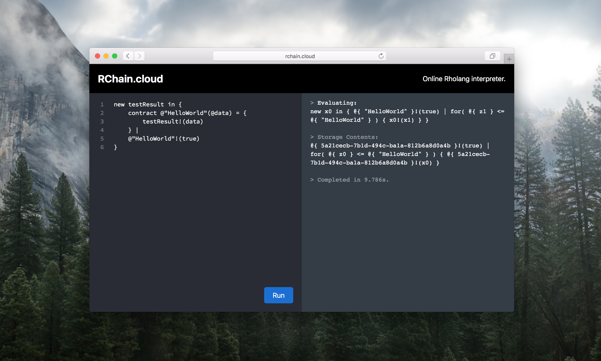

# rchain.cloud

**Web interface to play with the [Rholang](https://developer.rchain.coop/) language.**

[](http://rchain.cloud/)


## Find it online
Just want to play around with Rholang? Simply go to [rchain.cloud](http://rchain.cloud/).


## Running it locally
If you want to help develop rchain.cloud, or run your own instance, follow these instructions:
There are two options:
1) run:
docker-compose -f docker-compose-dev.yml up -d    
(to build an image from code that you developed)
or using offical stable images from docker hub by:
docker-compose -f docker-compose-prod.yml up -d

Other option is:
1. Ensure [Docker](https://www.docker.com/) and [Node.JS](https://nodejs.org) (version 8 or above) are installed on your machine.
2. Clone the Github repo to your desired location using `git clone https://github.com/th3build/rchain.cloud`.
3. Install NPM dependencies: `npm install`
4. Run it: `PORT=8080 npm start`


## Development
There's always [stuff](https://github.com/th3build/rchain.cloud/issues) that you can help develop.

Mayor features that are planned:

- [ ] Snippet sharing through unique URLs
- [ ] Support 'extended Rholang syntax' (`import`/`export`)


## POST API
You can send a POST request to `http://rchain.cloud/` to seed the editor with certain content. The POST body should be form-encoded, and can contain the following parameters:

- `content`: the code you want to show in the editor
- `version`: the Docker image tag you want to use to run your code (only supports `latest` at the moment)

This functionality allows you to create a 'Run on RChain.cloud' button. Usually this is done using a [hidden HTML form](https://jsfiddle.net/0zwtnr8c/):

```html
<form target="_blank" method="POST" action="http://rchain.cloud/">
   <input type="hidden" name="content" value="Your code here!" />
   <input type="hidden" name="version" value="latest" />
   <input type="submit" value="Run on RChain.cloud" />
</form>
```
Known errors:
'Network rnode-net declared as external, but could not be found. Please create the network manually using `docker network create rnode-net` and try again.'
Just run:
docker network create rnode-net
(only necessary first time)


-------------------------------------------------------

If you want to change default running ports for backend and frontend  then use .env file to store on which ports you want to run it.

There is an example of configuration in .env.example file.
Let's get through it:
We use docker image for frontend and another for backend.
There are two sources for images. Local dockerfiles where you can build your own images by using docker-compose-dev.yml file or production images published on docker hub that you can use by docker-compose-prod.yml file.

For development enviroment you can both configure internal and external ports (internal beign ones that service runs on inside container and external ones that service is exposed to host).

On production enviroment only change external ports as images are already builded with internal ports and cannot be changes via .env file.

Contents of .env file: (it should exists in the root of the project, where docker-compose-*.yml files are)
EXTERNAL_FRONTEND_PORT=81 
EXTERNAL_BACKEND_PORT=443
INTERNAL_BACKEND_PORT=80
INTERNAL_FRONTEND_PORT=3000
HTTPS=false
IP=rchain.cloud

HTTPS flag states if React frontend should work via https or if false via http (which is default currently - for the sake of simplicity).

IP is domain or ip you are running rcain.cloud on.

Deep dive into configurations:
BACKEND:
is built using Dockerfile.rchaincloudbackend. 
Important lines inside dockerfile are:
* scripts/install -> downloads and installs rnode.deb (which is how backend communicates with rchain blockchain)
* making directory for evaluations (when frontend sends code on backend that code is sent to running rnode instance which evaluates code and sends response) -> backend is just an intermediary between frontend and rnode.
* scripts/start -> running container with rnode and backend
(Contents of scripts/start)
*** 
cd app
npm start &
cd ..
rnode run --standalone --no-upnp --validator-private-key 46e729c476cf0a66a900c1bb3331b37358332e698dbff7d85265149b2822d2cd &> app/evaluations/output.log
***
We see here that backend is run via npm start => nodemon index.js (using & => sending process to background) 
and running rnode in standalone mode with validator private key and redirecting stout and stderr to app/evaluations/output.log so we can read that file with all the output of rnode.

Private key specified to run rnode is predefined as a validator that has stake and in this way we run rnode in write mode. If we don't run it with validator tat doesn't have stake we would run it in only read only mode and this won't work.

For current version to work we don't need no more parameters which can change in the future. 

For any questions or else send us a mail at: edi.sinovcic@gmail.com or open issue on github so we can help you.